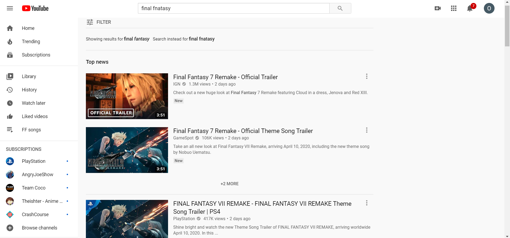
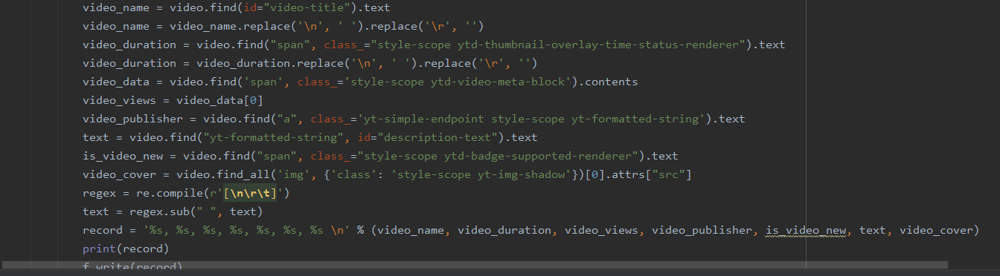
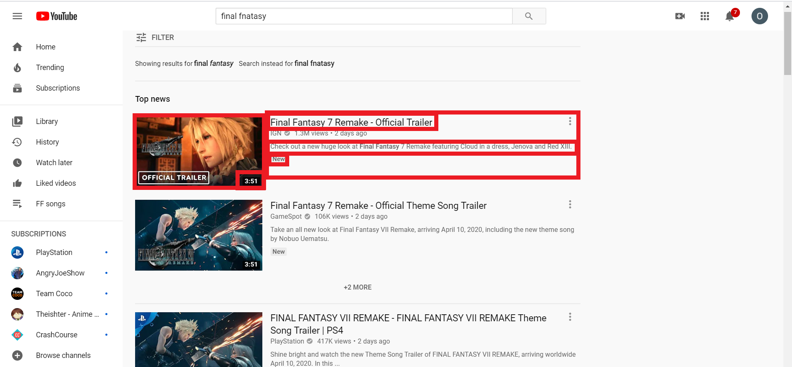

# Bot

**Meeting:** Wednesdays, 2:30 - 5:20, SMI 109

**Instructor:** Bo Zhao, SMI 416B, Office hours by appointment

**Contact:** 206.685.3846, zhaobo@uw.edu, jakobzhao (skype/wechat)

**Keywords:** Autonomy, Robot and Web crawler

**Student** Oliver Nie

##Motivation for the Project

The purpose of this project is to help anyone can easily collect information From
the youtube channel. This web-crawler should be available for any sort of youtube
search. If you want to change the subject from "final fantasy"(my key words) to
others, just simply change the url address to your targeting keywords.

###Focusing elements

The code help us to extract information from several sections. All the information,
I have crawled from the website. However, unlike tweet crawler we do not exclude
videos with redundant titles(a lot of videos are named the same way but the content are not)
We also have all the information of video thumbnails.

Taking in these sorts of information, we could use the data for further analysis or
marketing research.
